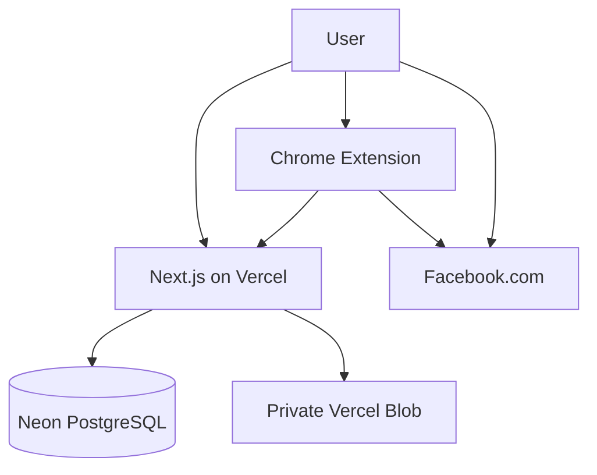

# Architecture

The application is a single Next.js App Router project. Vercel runs pages, route handlers, and server rendering from one project rooted at `.`. PostgreSQL stores relational data through Drizzle. Private Vercel Blob stores production uploads; a workspace-local file adapter is used only in development.

Web users receive a signed, HttpOnly, SameSite=Lax session cookie. The extension receives an opaque device token one time during pairing and sends it only from its service worker. Routes resolve the authenticated user's workspace from membership data; browser-supplied workspace IDs are not used for authorization.

The queue is stored with `scheduled_at`; no always-on server worker is needed. The extension claims one due job with a Postgres row lock. Assisted campaign runs use Chrome alarms, do not impose a fixed group-count limit, reserve submissions before enabling human-triggered posting, and record only recognizable Facebook publication confirmations. Users click Post on Facebook. Unknown outcomes require user review.
