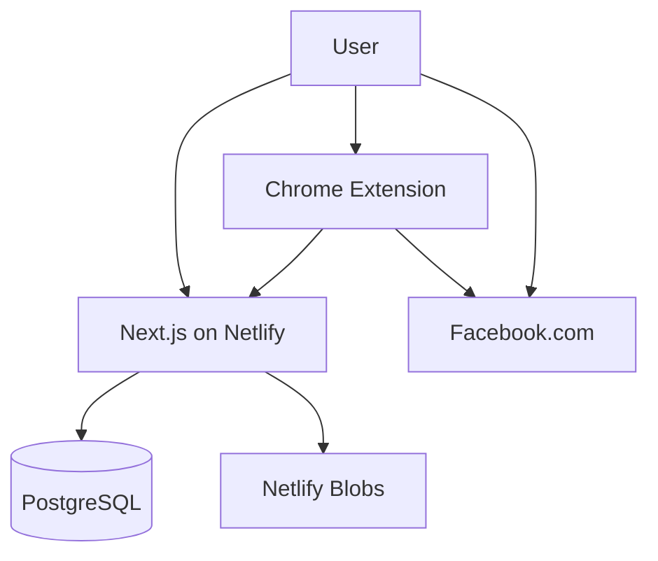

# Architecture

The application is a single Next.js App Router project. Netlify's current OpenNext adapter runs pages, route handlers, and server rendering from one site deployment. PostgreSQL stores relational data through Drizzle. Netlify Blobs stores production uploads; a workspace-local file adapter is used only in development.

Web users receive a signed, HttpOnly, SameSite=Lax session cookie. The extension receives an opaque device token one time during pairing and sends it only from its service worker. Routes resolve the authenticated user's workspace from membership data; browser-supplied workspace IDs are not used for authorization.

The queue is stored with `scheduled_at`; no always-on server worker is needed. The extension claims one due job with a Postgres row lock. Explicit automatic runs use Chrome alarms, are restricted to campaigns with at most three groups, reserve submissions before clicking, and record only recognizable publication confirmations. Unknown outcomes require user review.
