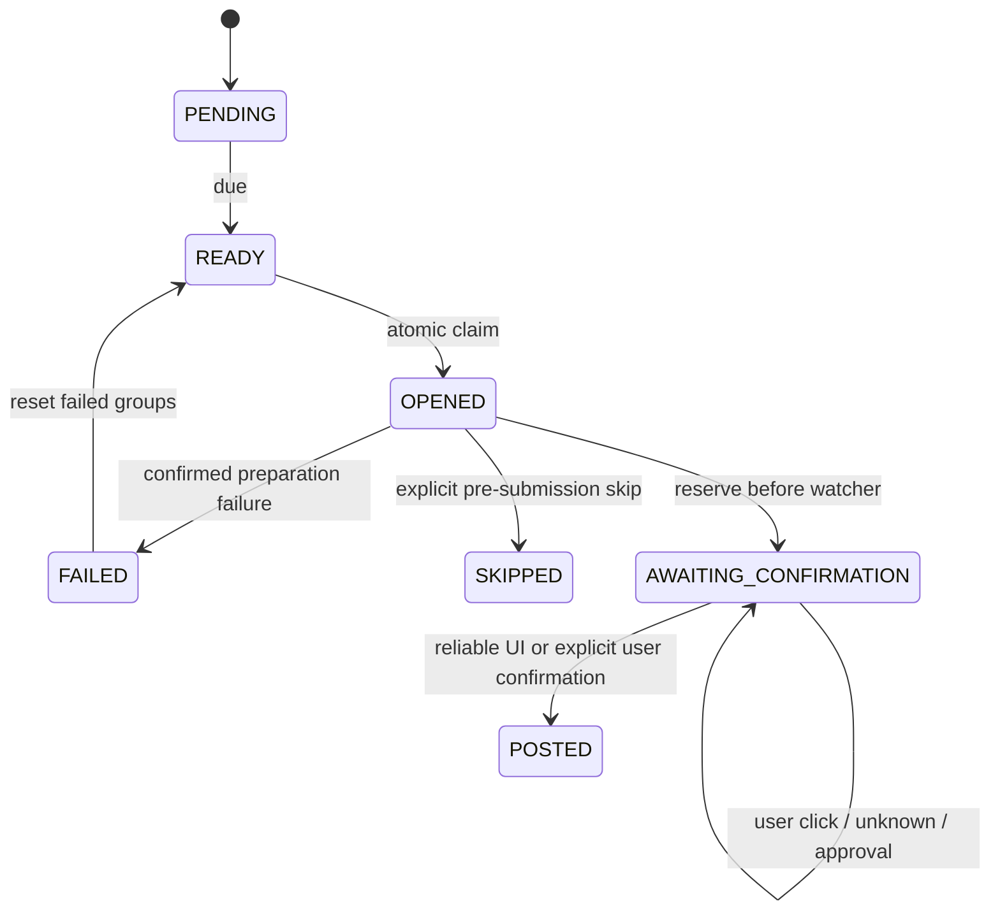

# Posting workflow

```mermaid
sequenceDiagram
participant U as User
participant W as Netlify Web App
participant DB as PostgreSQL
participant E as Chrome Extension
participant F as Facebook
U->>W: Sign in and create campaign
W->>DB: Generate scheduled queue
U->>W: Pair extension
E->>W: Request next eligible job
W->>DB: Claim job atomically
W-->>E: Group URL and caption
E->>F: Open Facebook Group
alt Facebook login or verification required
F-->>U: Show Facebook sign-in or verification
U->>F: Complete directly on Facebook
end
E->>F: Prepare caption and verify image previews
E->>W: Reserve submission (AWAITING_CONFIRMATION)
E->>F: Install trusted-click watcher
U->>F: Review and click Post directly on Facebook
E->>W: Record actual user click separately from reservation
alt Fresh publication confirmation for this group
E->>W: Confirm published (ui_confirmed)
W->>DB: Save POSTED/history once
E->>F: Open next due group
else Approval, conflicting or missing evidence
E->>U: Pause for manual review; never resubmit
U->>F: Check whether the post was really published
U->>E: Explicitly confirm only a verified publication
E->>W: Confirm published (user_confirmed)
end
```

Assisted campaigns have no fixed group-count cap. Stop monitoring stops local observation; Cancel stops server claims; Reset only affects FAILED jobs. Unknown and approval-required submissions remain AWAITING_CONFIRMATION. A reserve is not evidence that the user clicked Post, and a click is not evidence of publication.



Worker restart or lost watcher after tab reload pauses for review. The extension never automatically refills or submits an uncertain job. Uploaded preview identities are local-only; ambiguous/partial previews stop retry instead of attaching duplicate files. The prepared counter counts preparation/reservation, not confirmed Facebook publications.

## Editing a campaign

Open Campaigns, choose the campaign, then click Edit campaign. READY campaigns can be edited directly; pause a RUNNING campaign first and resolve OPENED or AWAITING_CONFIRMATION jobs before saving.

The editor supports changing the campaign name and intervals, selecting or creating content, editing caption/link, adding existing or new groups, updating group names/URLs, and removing groups from the campaign. Every saved campaign still needs one content item and at least one group. Removing the selected content clears the editor so it can be replaced with existing or new content; it does not delete library content. Group metadata is saved to the workspace immediately; campaign selection applies when Save campaign changes is clicked.

Edited captions create separate library content and copy the original images. Other campaigns keep their content. Changing content uses PRIMARY_ONLY to avoid retaining variants from the previous content. Pending jobs are rebuilt on paused campaigns; posted/skipped jobs and history are preserved. Removed failed jobs become skipped so Retry cannot publish to removed groups. A campaign with no remaining pending or selected failed jobs completes automatically.
## Deleting a campaign

Use Delete campaign in the campaign list or detail page. Confirmation explicitly warns that the campaign, selected-group links, queue and history are permanently removed. Shared library content, media, groups and actual Facebook posts are kept. The API checks the session, Origin and workspace and writes CAMPAIGN_DELETED to the audit log.

Pause a running campaign first. OPENED or AWAITING_CONFIRMATION jobs must be resolved before deletion, including in a cancelled campaign; deletion cannot erase uncertain submission evidence. This feature does not require a schema migration and does not automatically delete any existing campaigns.

## Content library images and details

Each saved content row shows its persisted image count, including after reloading the page. Details opens the caption, link, saved image previews, upload control, edit/duplicate/delete actions and variants. Only one row's details is open at a time.

Choose multiple JPG, PNG or WebP images to attach them to existing content. While uploading, conflicting edits and deletion are disabled. The count increases only after each successful response. A partial failure retains the remaining selection; Retry remaining images uploads only those files, while Clear selection discards the pending selection. When creating content, selected images are counted separately from saved images and are uploaded on Save content.

Image deletion: open Details and click Delete image below a thumbnail. Confirm the filename before deletion. The API verifies Origin, session and workspace; it removes only that image and its storage file. Failed storage deletion retains metadata for retry, and the visible count changes only after success. Images copied to other content have independent storage keys and remain available. Content changes apply to library content used by campaigns; deleting a library image does not remove an already published Facebook image.

Inline editing: click Edit within an item's Details. The edit form appears in that same card; saving updates its name, caption and link without leaving the page. A failed save retains the draft. Close discards unsaved edits. Uploading/deleting images and saving content disable conflicting actions while requests are active.

Management editors open next to their context: the Groups page shows its edit form in a full-width table row immediately below the selected group. Campaign settings contain their campaign editor, and editing a campaign group opens its form inside that group's row. The new-group form opens directly below Add a Facebook Group. Opening another group's editor resets the inputs to that group; saving refreshes the displayed row.
