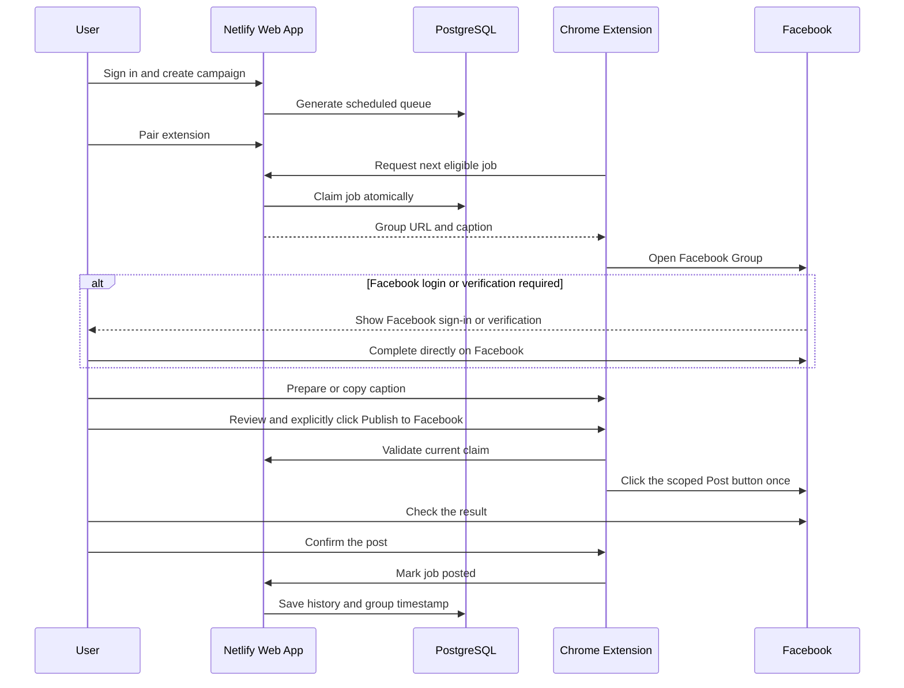

# Posting workflow

The sequence above describes manual publishing. Alternatively, the user selects a campaign with at most three groups and clicks Start automatic posting. The extension checks scheduled jobs every minute, attaches campaign images, reserves the submission on the server, and clicks Post once. A new recognizable publication notice records success; verification, approval, errors or unknown results stop the run for review. Stop prevents further submissions and cannot retract a click already sent.

