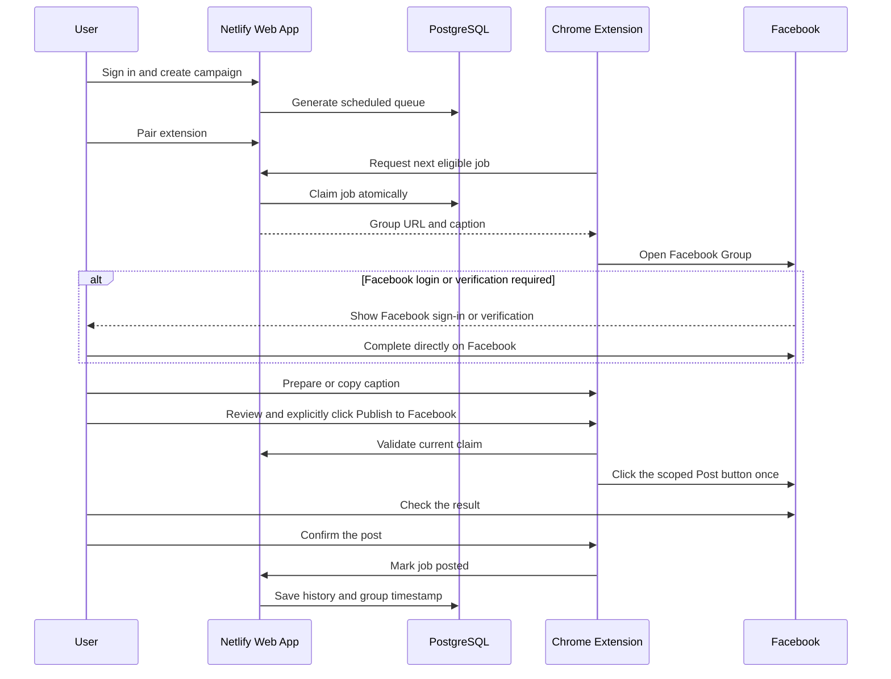

# Posting workflow

The sequence above describes manual publishing. Alternatively, the user selects a campaign with at most three groups and clicks Start automatic posting. The extension checks scheduled jobs every minute, attaches campaign images, reserves the submission on the server, and clicks Post once. A new recognizable publication notice records success; verification, approval, errors or unknown results stop the run for review. Stop prevents further submissions and cannot retract a click already sent.

## Editing a campaign

Open Campaigns, choose the campaign, then click Edit campaign. READY campaigns can be edited directly; pause a RUNNING campaign first and resolve OPENED or AWAITING_CONFIRMATION jobs before saving.

The editor supports changing the campaign name and intervals, selecting or creating content, editing caption/link, adding existing or new groups, updating group names/URLs, and removing groups from the campaign. Every saved campaign still needs one content item and at least one group. Removing the selected content clears the editor so it can be replaced with existing or new content; it does not delete library content. Group metadata is saved to the workspace immediately; campaign selection applies when Save campaign changes is clicked.

Edited captions create separate library content and copy the original images. Other campaigns keep their content. Changing content uses PRIMARY_ONLY to avoid retaining variants from the previous content. Pending jobs are rebuilt on paused campaigns; posted/skipped jobs and history are preserved. Removed failed jobs become skipped so Retry cannot publish to removed groups. A campaign with no remaining pending or selected failed jobs completes automatically.